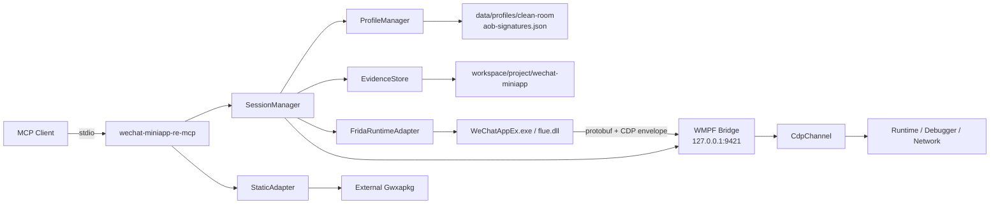

# wechat-miniapp-re-mcp

<p align="center">
  面向 PC 微信 WMPF Runtime 与 <code>.wxapkg</code> 的证据驱动型 MCP Server
</p>

<p align="center">
  <a href="https://github.com/Facetomyself/wechat-miniapp-re-mcp/actions/workflows/ci.yml"></a>
  
  
  
  <a href="LICENSE"></a>
</p>

<p align="center">
  <a href="#中文说明">中文说明</a> · <a href="#english-overview">English Overview</a>
</p>

---

<a id="中文说明"></a>

## 项目简介

`wechat-miniapp-re-mcp` 是一个面向 PC 微信小程序运行时（WMPF）和 `.wxapkg` 包的 Model Context Protocol（MCP）服务。它把目标发现、Frida lazy attach、WMPF protobuf/CDP bridge、JavaScript 调试、网络与 API 取证、静态还原、Profile 生命周期以及证据导出统一到一组 `wxmp_*` 工具中。

项目重点不是“返回一个看似成功的结果”，而是让每项动态能力都由实际探测结果支撑：

- stdio 服务可冷启动，启动阶段不依赖微信、Frida target、GUI、浏览器或 SSE；
- 动态操作使用显式 `session_id`，上下文相关操作进一步使用 `context_id`；
- WMPF bridge 连通只代表 transport ready，Debugger、Network、trace、request hook 等能力需分别通过探测；
- 生成的 Profile 必须绑定目标模块 SHA-256，并经过 review evidence promotion 后才进入注入链；
- 静态后端通过 adapter 隔离，核心仓库保持 clean-room 与 MIT 边界；
- 所有运行产物统一写入受控 workspace，并可导出 `report.md`、`findings.json`、`triage.md` 与 evidence manifest。

### 适用场景

- 发现和识别 PC 微信 WMPF 主进程、renderer 与运行时版本；
- 对 AppService、WebView 或小游戏上下文执行 evaluate、源码检索、断点和单步；
- 追踪 `wx.*`、云函数、存储、导航和网络调用；
- 同时使用 CDP Network 与 `wx.request` / `fetch` / `XMLHttpRequest` runtime hook 取证；
- 获取请求/响应正文、API inventory，并在原运行时上下文中 replay；
- 扫描、解包、还原、搜索、索引和 repack `.wxapkg`；
- 为新 WMPF 版本生成、验证和 review hash-bound offset profile；
- 导出可审计、可分页、带显式 capability gap 的分析证据。

### 项目边界

- Windows x64 是当前完整实现与验收主线；macOS 保留 discovery/profile adapter 边界，尚无同等级动态验收。
- 仓库不包含 WMPF 二进制、微信安装包、`.wxapkg` 样本、反编译全集、抓包文件、Cookie、凭据或第三方复制 Profile。
- Gwxapkg 等静态引擎由外部 adapter 调用，相关实现不会嵌入 MCP core。
- `package.json` 中的 `"private": true` 仅用于阻止误发布到 npm；GitHub 仓库本身为 Public。

## 核心架构



### 关键组件

| 组件 | 职责 |
|---|---|
| `SessionManager` | 管理 session、target、context、capability、Frida handle、bridge owner 与 reconnect 生命周期 |
| `FridaRuntimeAdapter` | lazy import Frida，向 reviewed offset 安装 WMPF hook，并将运行时事件写入 evidence |
| `WmpfBridgeServer` | 监听本地 WMPF debug bridge；采用 fail-safe single-owner，不猜测无握手协议下的 socket 归属 |
| `CdpChannel` | 配对 CDP command/response，索引 script、request、context、pause 与 trace event |
| `ProfileManager` | 装载 canonical profile、扫描 AOB、校验 hash/bounds、阻断 candidate 注入并记录 promotion evidence |
| `StaticAdapter` | 在受控 workspace 内调用 Gwxapkg，覆盖 decompile、search、index、repack 和 raw adapter |
| `EvidenceStore` | 持久化 NDJSON、限制 event/byte 容量、脱敏字段、记录异常并生成三件套 |

## 设计原则

### 1. Cold-start first

MCP 进程启动时只初始化轻量服务。微信进程发现、Frida、bridge、CDP、静态后端均在工具调用时按需加载。`wxmp_health` 在没有目标进程的环境中也应正常返回。

### 2. Session 与 Context 显式隔离

- 每次 attach 产生独立 `session_id`；
- context-sensitive 工具接受 `context_id`，省略时使用当前 selected context；
- script 和 request 会保留其来源 `contextId`；
- WMPF 未提供 context 的事件按 unscoped 处理，并回退到 selected context；
- 历史 session 可并存，但共享 `127.0.0.1:9421` bridge 同一时刻只分配一个 active/pending owner。

### 3. Capability 必须有证据

transport connected 不等于 Debugger、Network 或 trace 已可用。服务会分别执行 CDP domain probe、context probe 和 wrapper installation 检查：

- `Debugger` / `Network`：需成功完成对应 CDP probe；
- `wxTrace`：需实际安装至少一个 wrapper；
- `requestHook`：需实际安装 `wx.request`、`fetch` 或 XHR wrapper；
- runtime evaluate exception：返回结构化错误，而不是包装成成功结果。

### 4. Profile 默认 fail closed

generated candidate 的默认 confidence 为 `candidate`。在以下条件全部满足前，它保持不可注入：

1. WMPF version 与目标一致；
2. `moduleSha256` 与目标模块一致；
3. `cdpFilterOffset`、`loadStartOffset` 位于模块边界内；
4. AOB 每个 hook 只产生一个候选；
5. review 记录 reviewer、timestamp、evidence、decision 与 `medium` / `high` confidence。

### 5. 证据优先于“看起来成功”

动态事件、静态产物、错误、overflow、truncation、malformed NDJSON 和 write failure 都进入 evidence。对未满足的 capability，服务返回明确 finding 或结构化错误，不生成 synthetic success。

## 当前能力与验收状态

| 能力 | 状态 | 证据边界 |
|---|---|---|
| stdio cold start / initialize / list-tools / health | 已通过 | 无微信、无 Frida target 环境可运行 |
| MCP tool contract | 已通过 | `53` 个 `wxmp_*` tools |
| Node.js 20 / 22 CI | 已通过 | `99` tests、typecheck、contract、acceptance、smoke |
| WMPF v19977 动态语义链 | 已通过 | AppService、evaluate、真实 breakpoint、727 trace wrappers、request hook、Network body、replay、reconnect、detach、evidence export |
| WMPF v20079 Profile 交叉验证 | 已通过 | AOB 唯一命中、SHA-256、bounds、reviewed profile、生产 hook attach/ready/detach |
| WMPF v20079 完整 mini-program semantic gate | 待补齐 | AppService/CDP/Network/trace/request-hook/replay/reconnect 尚待同序列验证 |
| 静态 subprocess workflow | 已通过 | 真实 `execFile` 边界、decompile/search/index/repack、non-zero exit 与 no-output gate |
| macOS 动态链 | Adapter boundary | discovery path 已预留，完整 Profile 与 runtime gate 尚待实现 |

### Bundled Windows Profiles

| WMPF Version | Profile | 验收深度 |
|---:|---|---|
| `19977` | [`windows-19977.json`](data/profiles/clean-room/windows-19977.json) | 完整 live semantic gate |
| `20079` | [`windows-20079.json`](data/profiles/clean-room/windows-20079.json) | Profile/AOB/hash-binding 与 production attach/detach |

跨版本 AOB 数据库位于 [`data/profiles/aob-signatures.json`](data/profiles/aob-signatures.json)。其中 `cdpFilter` 与 wildcarded `loadStart` pattern 在 reviewed `19977/20079` 模块上均为唯一命中。

完整进度和 acceptance boundary 见 [`docs/progress.md`](docs/progress.md)。

## 快速开始

### 环境要求

- Node.js `>= 20`；CI 固定验证 Node.js 20 与 22；
- npm 与项目锁文件匹配；
- 动态链：Windows、PC 微信 WMPF runtime，以及可用的 Frida native dependency；
- 静态链：可选 Gwxapkg executable；
- 支持 stdio MCP 的客户端，如 Claude Code、Codex 或其他 MCP host。

### 独立安装

```powershell
git clone https://github.com/Facetomyself/wechat-miniapp-re-mcp.git
Set-Location "wechat-miniapp-re-mcp"

npm ci
npm run build
npm run smoke
```

### 在 `reverse_ENV` 中初始化

```powershell
git -C "D:\reverse_ENV" submodule update --init "mcp/wechat-miniapp-re-mcp" "tools/Gwxapkg"

& "D:\reverse_ENV\tools\node\npm.cmd" `
  --prefix "D:\reverse_ENV\mcp\wechat-miniapp-re-mcp" ci

& "D:\reverse_ENV\tools\node\npm.cmd" `
  --prefix "D:\reverse_ENV\mcp\wechat-miniapp-re-mcp" run check
```

### 构建与启动

```powershell
npm run build
node build/src/index.js
```

`node build/src/index.js` 启动的是 stdio MCP server，通常应由 MCP client 拉起。手工验证 cold-start、initialize、list-tools 和 `wxmp_health` 时，优先运行：

```powershell
npm run smoke
```

## MCP Client 配置

### 通用 JSON 示例

```json
{
  "mcpServers": {
    "wechat-miniapp-re-mcp": {
      "command": "C:\\path\\to\\node.exe",
      "args": [
        "C:\\path\\to\\wechat-miniapp-re-mcp\\build\\src\\index.js"
      ],
      "env": {
        "WXMP_WORKSPACE_ROOT": "D:\\reverse_ENV\\workspace",
        "WXMP_GWXAPKG": "D:\\reverse_ENV\\tools\\Gwxapkg-runtime\\gwxapkg.exe"
      }
    }
  }
}
```

### Codex TOML 示例

```toml
[mcp_servers.wechat-miniapp-re-mcp]
command = "D:\\reverse_ENV\\tools\\node\\node.exe"
args = ["D:\\reverse_ENV\\mcp\\wechat-miniapp-re-mcp\\build\\src\\index.js"]

[mcp_servers.wechat-miniapp-re-mcp.env]
REVERSE_ENV_ROOT = "D:\\reverse_ENV"
WXMP_WORKSPACE_ROOT = "D:\\reverse_ENV\\workspace"
WXMP_GWXAPKG = "D:\\reverse_ENV\\tools\\Gwxapkg-runtime\\gwxapkg.exe"
```

动态工具依赖目标 runtime，建议将服务配置为按需启用；cold-start 本身不要求目标在线。

## 环境变量

| 变量 | 默认值 / 解析规则 | 用途 |
|---|---|---|
| `REVERSE_ENV_ROOT` | 未设置 | 提供 `reverse_ENV` 根目录，用于 workspace 与 Gwxapkg fallback |
| `WXMP_WORKSPACE_ROOT` | 优先 `<cwd>/workspace`，其次 `REVERSE_ENV_ROOT/workspace`，最后 `<cwd>/.wxmp-workspace` | 所有 session、profile、static 与 evidence 产物根目录 |
| `WXMP_PROFILE_DIR` | bundled clean-room profile 自动加入 | 额外 Profile 目录；支持按操作系统 path delimiter 传入多个路径 |
| `WXMP_LEGACY_PROFILE_DIR` | 空 | 外部 First-style legacy Profile 目录；只作本地兼容输入 |
| `WXMP_SIGNATURE_DB` | bundled `data/profiles/aob-signatures.json` 自动加入 | 额外 AOB signature database |
| `WXMP_GWXAPKG` | 自动探测 `tools/Gwxapkg-runtime/gwxapkg.exe` | 静态 adapter executable |
| `WXMP_DEBUG_HOST` | `127.0.0.1` | WMPF debug bridge host |
| `WXMP_DEBUG_PORT` | `9421` | WMPF debug bridge port |
| `WXMP_EVENT_LIMIT` | `5000` | 单次 evidence query 最大事件数 |
| `WXMP_MAX_EVIDENCE_EVENTS` | `100000` | 单 session 持久化事件上限 |
| `WXMP_MAX_EVIDENCE_BYTES` | `268435456` | 单 session NDJSON 字节上限，默认 256 MiB |

## 推荐工作流

### 动态 WMPF 调试

```text
wxmp_health
  -> wxmp_list_targets
  -> wxmp_attach(project_name, pid?)
  -> wxmp_wait_for_runtime(session_id)          # lifecycle-triggered bridge 尚未出现时
  -> wxmp_probe_contexts(session_id)
  -> wxmp_select_context(session_id, context_id)
  -> evaluate / source / breakpoint / trace / network / replay
  -> wxmp_export_evidence(session_id)
  -> wxmp_detach(session_id)
```

关键点：

- `wxmp_attach` 未传 `pid` 时，默认选择 main WMPF browser process；
- `project_name` 决定 evidence 输出目录；
- mini-program selector 或 foreground/reload 可能触发 WMPF debug bridge 生命周期；
- unexpected disconnect 会保留 MCP session、evidence 和 context listener，并重新排队同一 bridge owner；
- reconnect 使用 `wxmp_wait_for_runtime`，无需重复注入 Frida；
- attach 后先运行 `wxmp_probe_contexts`，再选择最强 AppService / wx-capable context。

### 源码与断点

```text
wxmp_list_scripts
  -> wxmp_get_source / wxmp_search_sources
  -> wxmp_set_breakpoint
  -> wxmp_pause_info
  -> wxmp_step_over / wxmp_step_into / wxmp_step_out
  -> wxmp_resume
```

`wxmp_set_breakpoint` 返回：

- `boundLocations > 0`：已绑定到实际 script location；
- `pending = true`：URL/regex breakpoint 正在等待未来加载的脚本；
- 空 location 不代表已完成 breakpoint semantic gate。

### Trace 与网络

```text
wxmp_trace_start
  -> wxmp_trace_query
  -> wxmp_trace_stop

wxmp_hook_wx_request
  -> wxmp_get_hooked_requests
  -> wxmp_unhook_wx_request

wxmp_capture_start
  -> wxmp_list_requests / wxmp_get_request
  -> wxmp_get_api_inventory
  -> wxmp_replay_request
  -> wxmp_capture_stop
```

- trace 以 reversible wrapper 覆盖 `wx.*`、cloud、storage、navigation 和 network 分类；
- `wrapped=0` 返回 `TRACE_TARGET_UNAVAILABLE`；
- request hook 覆盖 `wx.request`、`fetch`、`XMLHttpRequest`，保存 bounded body preview 与 JavaScript call stack；
- CDP Network 与 request hook 是互补证据源；
- response body 与 replay 使用 request 的 originating context；unscoped WMPF event 回退到 selected context。

### 静态 `.wxapkg` 工作流

```text
wxmp_scan_packages
  -> wxmp_decompile / wxmp_unpack
  -> wxmp_static_search
  -> wxmp_build_index
  -> wxmp_repack
```

- 默认扫描 Windows PC 微信 package root；也可传入显式 roots；
- output 始终落在 `<workspace>/<project>/wechat-miniapp/static/`；
- caller-supplied `-out` 会被拒绝，避免输出越过受控 workspace；
- decompile/repack 通过真实 subprocess 执行；non-zero exit、missing input 和 success-with-no-output 均映射为结构化错误；
- index 提取 URL、`wx.*` API、route 与文件清单。

### WMPF Profile 生命周期

```text
wxmp_detect_wmpf
  -> wxmp_profile_probe
  -> wxmp_profile_generate
  -> wxmp_profile_validate
  -> wxmp_profile_promote
  -> wxmp_attach(profile_path=reviewed_profile)
```

Profile 分为三类：

| 来源 | 注入状态 | 说明 |
|---|---|---|
| bundled clean-room | review decision 为 `promoted` 后可注入 | canonical filename：`windows-<version>.json` |
| generated candidate | 默认阻断 | 需 hash、bounds 和 review evidence promotion |
| external legacy | 兼容输入 | 未绑定 module hash 时生成显式 finding |

`wxmp_profile_generate` 可接收显式 `cdpFilter/loadStart` signatures；省略 signatures 时，从 version-verified AOB database 读取。生成结果写入：

```text
<workspace>/<project>/wechat-miniapp/profiles/windows-<version>-candidate.json
```

## 53 个 MCP Tools

| 分组 | 数量 | Tools |
|---|---:|---|
| Health / Session / Context | 11 | `wxmp_health`, `wxmp_list_targets`, `wxmp_list_sessions`, `wxmp_attach`, `wxmp_detach`, `wxmp_session_status`, `wxmp_wait_for_runtime`, `wxmp_list_contexts`, `wxmp_select_context`, `wxmp_probe_contexts`, `wxmp_get_runtime_info` |
| Runtime / Source / Debugger | 13 | `wxmp_evaluate`, `wxmp_raw_cdp`, `wxmp_list_scripts`, `wxmp_get_source`, `wxmp_search_sources`, `wxmp_set_breakpoint`, `wxmp_remove_breakpoint`, `wxmp_pause_info`, `wxmp_pause`, `wxmp_step_over`, `wxmp_step_into`, `wxmp_step_out`, `wxmp_resume` |
| Trace / Network / Runtime API | 14 | `wxmp_trace_start`, `wxmp_trace_query`, `wxmp_trace_stop`, `wxmp_hook_wx_request`, `wxmp_get_hooked_requests`, `wxmp_unhook_wx_request`, `wxmp_capture_start`, `wxmp_capture_stop`, `wxmp_list_requests`, `wxmp_get_request`, `wxmp_get_api_inventory`, `wxmp_replay_request`, `wxmp_call_wx_api`, `wxmp_call_cloud_function` |
| Human DevTools Bridge | 2 | `wxmp_devtools_proxy_start`, `wxmp_devtools_proxy_stop` |
| Static Package | 7 | `wxmp_scan_packages`, `wxmp_unpack`, `wxmp_decompile`, `wxmp_static_search`, `wxmp_build_index`, `wxmp_repack`, `wxmp_raw_adapter` |
| Profile | 5 | `wxmp_detect_wmpf`, `wxmp_profile_probe`, `wxmp_profile_generate`, `wxmp_profile_validate`, `wxmp_profile_promote` |
| Evidence | 1 | `wxmp_export_evidence` |

每个 tool 的参数、约束与返回语义见 [`docs/api.md`](docs/api.md)。

## Workspace 与证据产物

典型目录结构：

```text
<WXMP_WORKSPACE_ROOT>/
└── <project_name>/
    └── wechat-miniapp/
        ├── sessions/
        │   └── wxmp-<uuid>/
        │       ├── events.ndjson
        │       ├── evidence-manifest.json
        │       ├── report.md
        │       ├── findings.json
        │       ├── triage.md
        │       └── script-*.js / search artifacts / large previews
        ├── profiles/
        │   ├── windows-<version>-candidate.json
        │   └── windows-<version>-reviewed-<timestamp>.json
        └── static/
            ├── decompile-<timestamp>/
            ├── indexes/index-<timestamp>.json
            ├── repacked/*.wxapkg
            └── raw/
```

### Evidence 保护机制

- credential-shaped keys 在持久化前脱敏；
- 大源码和 body 使用 artifact path + bounded preview；
- 单 event 超限时记录 truncation finding；
- session event/byte cap 超限时记录 overflow finding；
- malformed NDJSON line 与 write failure 会进入导出 findings；
- export 前等待异步写队列 flush；
- `report.md`、`findings.json`、`triage.md` 的 claim 由 session status 与 evidence event 派生。

## 返回与错误模型

成功结果统一包装为：

```json
{
  "ok": true,
  "data": {}
}
```

业务失败使用结构化 `WxmpError`。常见 error code 包括：

| Error code | 含义 |
|---|---|
| `TARGET_NOT_FOUND` | PID 或目标版本未找到 |
| `PROFILE_REVIEW_REQUIRED` | candidate / unreviewed profile 被注入门禁阻断 |
| `PROFILE_HASH_MISMATCH` | Profile 与目标模块 SHA-256 不一致 |
| `PROFILE_OUT_OF_BOUNDS` | hook offset 越过模块边界 |
| `CONTEXT_NOT_SELECTED` | context-sensitive tool 缺少有效上下文 |
| `RUNTIME_EVALUATION_FAILED` | Runtime.evaluate 返回 exception details |
| `TRACE_TARGET_UNAVAILABLE` | selected context 没有可包装的 `wx.*` API |
| `REQUEST_HOOK_TARGET_UNAVAILABLE` | selected context 没有支持的 request API |
| `STATIC_INPUT_NOT_FOUND` | 静态输入路径不存在 |
| `STATIC_ADAPTER_FAILED` | 外部静态 backend 返回 non-zero exit |
| `STATIC_ADAPTER_NO_OUTPUT` | backend 返回成功但未生成有效产物 |

## 开发与验证

```powershell
npm ci
npm run typecheck
npm test
npm run acceptance
npm run contract
npm run smoke
npm run live-gate:dry -- --wmpf-version 20079
npm run check
npm audit --omit=dev --audit-level=high
git diff --check
```

### `npm run check` 包含

1. TypeScript strict typecheck；
2. build + Node test suite；
3. MCP tool/API/version contract + acceptance records；
4. stdio initialize/list-tools/health smoke。

CI 位于 [`.github/workflows/ci.yml`](.github/workflows/ci.yml)，使用 Node.js 20 与 22 matrix。当前基线为：

- `99` tests；
- `53` MCP tools；
- production dependency audit：`0 vulnerabilities`（以最近一次审计为准）。

### Acceptance 与真实 target gate

机器可读版本验收记录位于 [`data/acceptance/`](data/acceptance/README.md)。`npm run acceptance` 会校验 schema、record inventory、Profile 文件 SHA-256、module SHA-256、evidence 引用，以及 `profile-static` / `profile-runtime` / `full-semantic` 深度是否名副其实。

真实 WMPF gate 使用 tracked runner，不再从 `.wxmp-workspace` 临时脚本复制：

```powershell
& "D:\reverse_ENV\tools\node\npm.cmd" run live-gate:dry -- --wmpf-version 20079
& "D:\reverse_ENV\tools\node\npm.cmd" run live-gate -- --wmpf-version 20079
```

runner 固定执行 Profile/AOB、attach/bridge、AppService、evaluate、breakpoint、API inventory、trace、request hook、Network body、replay、reconnect、detach 和 evidence export。失败也会生成结构化 summary 与三件套 evidence；`--skip-reconnect` 只能用于缩减诊断，不能形成 `full-semantic` acceptance。

### 提交规则

- 默认分支为 `main`，功能与文档改动通过 feature branch + pull request；
- 新增 tool 时同步 contract test、README 与 API 文档；
- public tool schema 变化时更新 package version；
- 提交前运行 `npm run check`、`git diff --check`、`git status --short`；
- 不提交 `build/`、`node_modules/`、runtime logs、evidence、package payload、目标二进制和凭据。

## Public 仓库审计

仓库在切换为 Public 前完成 working tree、reachable history、PR 文本与 GitHub Actions log 审计。切换时的审计范围覆盖：

- `73` 个 tracked files；
- `242` 个 reachable Git blobs；
- `10` 个历史 PR 的 title/body/comment/review 集合；
- `32` 个截至 Public delivery merge 的 Actions runs。

审计未发现 raw credential、private key、credential-bearing URL、敏感文件名、禁入二进制/package 或大于 5 MiB 的 tracked/history blob。GitHub Actions 中的 authentication field 均保持 `***` mask。

## 文档索引

| 文档 | 内容 |
|---|---|
| [`docs/api.md`](docs/api.md) | 53 个 MCP tools 的参数与关键语义 |
| [`docs/progress.md`](docs/progress.md) | 实现完成度、真实 target gate 与剩余项 |
| [`docs/roadmap.md`](docs/roadmap.md) | 当前后续完善路线图、优先级与验收门槛 |
| [`docs/plan.md`](docs/plan.md) | 初始交付计划与 locked decisions，主体阶段已完成 |
| [`docs/original-plan.md`](docs/original-plan.md) | 初始 `/plan` 会话产物，保留历史决策背景 |
| [`docs/lessons-learned.md`](docs/lessons-learned.md) | 已知行为、运行时坑点和经验 |
| [`docs/deep-analysis-and-research-report.md`](docs/deep-analysis-and-research-report.md) | 2026-07-15 历史研究快照，当前状态以 progress/roadmap 为准 |
| [`AGENTS.md`](AGENTS.md) | 仓库边界、架构约束、开发和 Git 规则 |

## Roadmap

- `0.3.2`：建立可重复 live semantic gate，在 v20079 完成第二版本完整验证，并收口 acceptance manifest 与文档事实源；
- `0.4.0`：补齐 structured output、tool annotations、Inspector gate，以及调用栈/作用域/XHR breakpoint/WebSocket/WASM 等调试原语；
- `0.5.0`：完善 evidence 分层、静态索引 v2、runtime/static correlation 和外部 Profile candidate import contract；
- `1.0.0-rc`：完成架构拆分、关键状态机覆盖率、跨平台 core CI、release/tag/changelog 与兼容性冻结。

完整优先级、验收门槛和明确不做项见 [`docs/roadmap.md`](docs/roadmap.md)。

## License

MCP core 采用 [MIT License](LICENSE)。第三方静态后端、WMPF runtime、微信客户端和其他外部组件遵循各自许可证与分发边界；本仓库不复制其实现或二进制。

---

<a id="english-overview"></a>

## English Overview

`wechat-miniapp-re-mcp` is an evidence-driven Model Context Protocol server for PC WeChat WMPF runtimes and `.wxapkg` packages. The Chinese documentation above is the canonical and most detailed project guide; this section provides an English operational overview.

### What it provides

- cold-startable stdio MCP server with no startup dependency on WeChat, Frida targets, a GUI, SSE, or a daemon;
- explicit `session_id` and `context_id` isolation;
- lazy Frida attach plus a local WMPF protobuf/CDP bridge;
- AppService/WebView/mini-game context probing and strongest-context selection;
- JavaScript evaluation, source retrieval/search, breakpoints, pause/step/resume;
- reversible `wx.*` tracing and request hooks for `wx.request`, `fetch`, and `XMLHttpRequest`;
- CDP Network capture, request/response body retrieval, API inventory, and in-runtime replay;
- adapter-isolated `.wxapkg` scan/decompile/search/index/repack workflow;
- hash-bound WMPF profile generation, validation, review promotion, and injection gating;
- NDJSON evidence persistence plus `report.md`, `findings.json`, `triage.md`, and evidence manifests.

### Architecture guarantees

- A connected bridge proves transport only. Debugger, Network, trace, and request-hook capabilities are enabled only after successful probes or non-zero wrapper installation.
- Multiple historical MCP sessions are retained, while the handshake-free shared WMPF bridge uses one fail-safe active/pending owner.
- Unexpected runtime disconnects keep the MCP session and evidence state, requeue the same owner, and allow `wxmp_wait_for_runtime` reconnect without reinjecting Frida.
- Generated profile candidates bind to the target module SHA-256 and remain non-injectable until explicit review evidence promotes them.
- Third-party binaries, copied profiles, packages, captures, credentials, and generated target material stay outside Git.

### Quick start

```powershell
git clone https://github.com/Facetomyself/wechat-miniapp-re-mcp.git
Set-Location "wechat-miniapp-re-mcp"

npm ci
npm run build
npm run check
```

Configure an MCP client to launch:

```text
node <absolute-path>/build/src/index.js
```

Minimal MCP JSON configuration:

```json
{
  "mcpServers": {
    "wechat-miniapp-re-mcp": {
      "command": "node",
      "args": ["C:\\absolute\\path\\build\\src\\index.js"],
      "env": {
        "WXMP_WORKSPACE_ROOT": "C:\\absolute\\workspace"
      }
    }
  }
}
```

### Recommended dynamic sequence

```text
wxmp_health
  -> wxmp_list_targets
  -> wxmp_attach
  -> wxmp_wait_for_runtime (when needed)
  -> wxmp_probe_contexts
  -> wxmp_select_context
  -> debugger / trace / network tools
  -> wxmp_export_evidence
  -> wxmp_detach
```

### Tool inventory

The server currently exposes `53` tools:

- 11 health/session/context tools;
- 13 runtime/source/debugger tools;
- 14 trace/network/runtime-API tools;
- 2 DevTools proxy tools;
- 7 static package tools;
- 5 profile lifecycle tools;
- 1 evidence export tool.

See [`docs/api.md`](docs/api.md) for the complete API reference.

### Acceptance status

| Area | Status |
|---|---|
| stdio cold start, contract, smoke | Verified |
| Node.js 20 and 22 CI | Verified, 99 tests |
| WMPF v19977 full live semantic workflow | Verified |
| WMPF v20079 profile/AOB/hash binding and production attach/detach | Verified |
| WMPF v20079 full mini-program semantic workflow | Pending repeat gate |
| Static subprocess decompile/search/index/repack | Verified |
| macOS runtime workflow | Adapter boundary |

### Development

```powershell
npm run typecheck
npm test
npm run contract
npm run smoke
npm run check
npm audit --omit=dev --audit-level=high
git diff --check
```

Feature work is delivered through pull requests. New public tools require contract tests and README/API updates; public schema changes require a package version bump.

### License

The MCP core is licensed under the [MIT License](LICENSE). External runtimes, clients, and static backends retain their own licenses and distribution boundaries.
